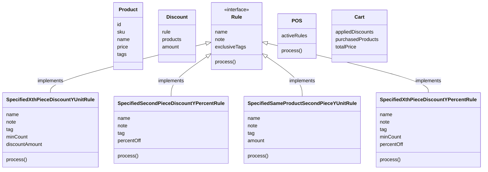

# Introduction

POC: Abstraction design using discount mechanism as example

---

# Class Diagram

```mermaid
classDiagram

class Product {
  id
  sku
  name
  price
  tags
}

class Discount {
  rule
  products
  amount
}

Rule <|-- SpecifiedXthPieceDiscountYUnitRule : implements
Rule <|-- SpecifiedSecondPieceDiscountYPercentRule : implements
Rule <|-- SpecifiedSameProductSecondPieceYUnitRule : implements
Rule <|-- SpecifiedXthPieceDiscountYPercentRule : implements

class Rule {
    <<interface>>
    name
    note
    exclusiveTags
    process()
}

class SpecifiedXthPieceDiscountYUnitRule {
    name
    note
    tag
    minCount
    discountAmount
    process()
}

class SpecifiedSecondPieceDiscountYPercentRule {
  name
  note
  tag
  percentOff
  process()
}

class SpecifiedSameProductSecondPieceYUnitRule {
  name
  note
  tag
  amount
  process()
}

class SpecifiedXthPieceDiscountYPercentRule {
  name
  note
  tag
  minCount
  percentOff
  process()
}

class POS {
  activeRules
  process()
}

class Cart {
  appliedDiscounts
  purchasedProducts
  totalPrice
}


```